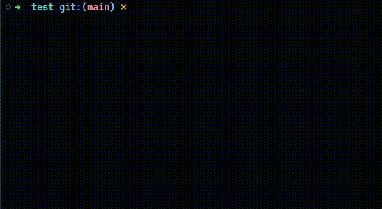

# cex
compile and run c/c++ programs in a single command

 

## Usage
```
Usage: cex [PROGRAM_FILES]... [COMPILER_OPTIONS]... [PROGRAM_ARGUMENTS]...
compile and execute programs from the command line.

example usage:
cex  main.c
cex  main.c arg1 arg2
cex  main.c -Wall -Wextra arg1 arg2
cex  main.c < <input file>
```
## Install
- clone the repository 
```bash
git clone https://github.com/vskvj3/cex
```
- move the bash script to an executable path
```bash
cd cex
sudo install -m 755 cex /usr/local/bin/cex
```